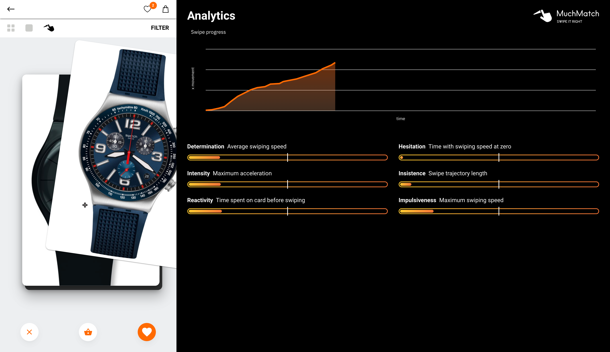
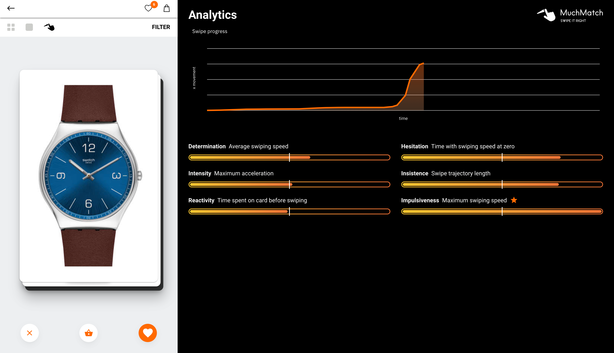
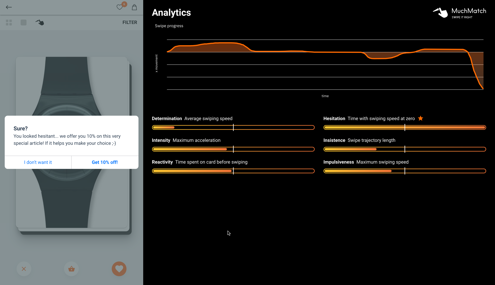

# MuchMatch: Swipe it right!

## Abtract
The near-unlimited choice of items presented in online stores leads users on journeys of untargeted and unsatisfying scrolling through bottomless pages on the search for products they really like.

With Much-Match, we introduce a totally **new**, **intuitive** and **fun way** of **browsing shopping catalogues**, leveraging a familiar technology: **swiping**. The backend algorithm of Much-Match continuously analyses what users swipe left and right and **how they swipe it**, creating a user profile that allows for meaningful and targeted suggestions.    
Swipes **are characterized measuring features** like speed, reaction time or hesitation which provide an insight into people’s personal profile. Our preliminary analysis has shown that users indeed expose different general swiping behaviours. This enables two key mechanisms in our backend design: First, **users can be matched to a user group** and a behavioural pattern in a meaningful way. Second, swipes can be **characterised related to how a user normally swipes**, allowing to detect how much a user likes or dislikes a product.

Much-Match is a new way of navigating users straight to their purchase through swiping analysis. We give meaningful and targeted suggestions where user information seemed to be unavailable. This narrows down the vast choice in the online shopping world, leading to buying decisions that are quicker and more convenient.

## Demo App
Based on determined features during our data collection and analysis, and for demonstration purposes during our final presentation, we developed an app to showcase our experiments with the previously described algorithm.

Although we were lacking a huge data collection and a proper data study, we were already able to give insightful data in our demonstration.

The demo app is a dashboard displaying computed features from collected data during a swipe gesture. This data is compared to a small set of swiping test data we were able to collect in two weeks. We tried to put a name on those features based on users feedback and from our analysis. We also wanted to show if a swipe was usual or not usual.   
A phone can be connected through a websocket connection for a better experience.

### Swiping analysis

### Detect unsusual behaviors

### Interaction based on gesture analysis

## Authors
- Fristedt Andersson Anna Vera Linnea
- Rüther Johannes Leonhard
- Sørensen Mikkel Frisaek
- Viennot Valentin